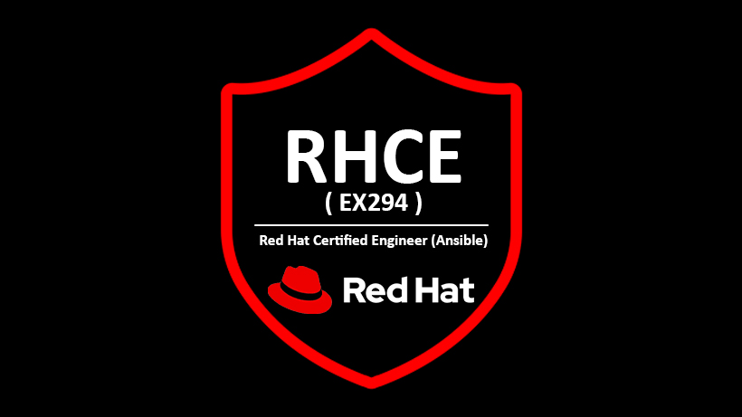

## Hi Enthusiasts , I am Sarthak Agarwal 👨‍🎓

<!--Header-->

  

## Connect Me At Below
  <!--social media icon-->

 
 
 
 

  

 

<!--About Me-->

 

 

  

## About Me ✍
 

I'm Sarthak Agarwal, an <b>AWS & RedHat Certified Cloud & DevOps Enthusiast</b> from India. Currently, I work as a <b>DevOps Engineer at Integraate Innovations</b>. Previously, I served as a <b>DevOps Lead at TFG, Platform Engineer at Qolaba</b> and a <b>DevOps Engineer at CureSkin</b>, Bangalore. I'm driven by a passion for software development, turning ideas into reality with seamless interfaces. I take pride in the <b>Experience, Architecture, Configuration, and Deployment</b> of the systems I create. My enthusiasm lies in diving deep into the core concepts of various cutting-edge technologies. 

<h2>Certification & Badges</h2> 

    
          
      
     
  

 
<!--technical skill-->

## Technical Skills 🛠 

 

 
 
 
 
 
 

  

 <!--My Hobbies-->
 
 

## My Hobbies ✍

 
Having a hobby is a <b>great</b> <b>thing</b> for each and every one because it not only entertains me
but also gives me various benefits which can improve the quality of my life. It <b>reduces your mental stress and gives a soothing and relaxing feeling</b>. My hobby is also one of them and I read various kinds of books. Also, I love playing cards and flying kites. I also play <b>volleyball</b> and <b>cricket</b> from time to time. I have also started <b>writing technical blogs</b> so that I could make my hobby my profession and some of them are as follows.
##
##
##

<!--BLOG Process-->
## My Projects & Technical Blogs 🤓

<table><tr><td valign="top" width="25%">

### [DevOps]
<!-- recent_releases starts -->

[Multi Node Kubernetes Cluster On AWS using Ansible](https://www.linkedin.com/posts/sarthak-agarwal-0476331b1_connetions-vimaldaga-righteducation-activity-6850406720590626816-MhGI)

[Jenkins Master-Slave Pipeline on AWS](https://www.linkedin.com/posts/sarthak-agarwal-0476331b1_jenkins-master-slave-pipeline-on-aws-activity-7013429844986228736-Vfwp?utm_source=share&utm_medium=member_desktop)  
  
[GUI container on the Docker](https://www.linkedin.com/posts/sarthak-agarwal-0476331b1_connetions-vimaldaga-righteducation-activity-6805471904711884801-m3LE)

[Creating Load Balancer On AWS Using Ansible](https://www.linkedin.com/posts/sarthak-agarwal-0476331b1_connetions-vimaldaga-righteducation-activity-6790688268057931776-6zWM)

[Launching ec2 instance & configuring webserver in MN by Dynamic Inventory using Ansible on AWS](https://www.linkedin.com/posts/sarthak-agarwal-0476331b1_connections-ansible-awsdevops-activity-6788200078134788096-F6Qb)

[Docker 🐳 Integration with Ansible](https://www.linkedin.com/posts/sarthak-agarwal-0476331b1_integration-of-docker-and-ansible-activity-6785885035280003072-68w9)

[Webserver Configuration inside Docker Container by auto updating the Ansible inventory file](https://www.linkedin.com/posts/sarthak-agarwal-0476331b1_connetions-vimaldaga-righteducation-activity-6789932452480733184-m66r)
  
[Restarting HTTPD Service is not idempotence in nature](https://www.linkedin.com/posts/sarthak-agarwal-0476331b1_connections-ansible-worldrecordholder-activity-6786732270830014464-UZMx)
  
[Running Python Libraries inside Docker](https://sarthakagarwal-9711.medium.com/firstly-we-launch-a-docker-container-centos-inside-our-base-operating-system-and-then-we-run-the-e9e6a2015769)
  
[Kubernetes Case Study](https://sarthakagarwal-9711.medium.com/kubernetes-and-its-case-study-with-spotify-5a1ed145487e)

</td><td valign="top" width="25%"> 

### [Terraform]
  
[Automated Terraform code to configure EKS & its services on AWS](https://github.com/Sarthak-Agarwal1410/eks-aws-tf.git)

[Deployment of EKS Cluster using Terraform on AWS](https://github.com/Sarthak-Agarwal1410/eks-aws-tf.git)  

[Github actions on GCP using Terraform](https://github.com/Sarthak-Agarwal1410/github-actions-gcp-using-terraform.git) 
  
[Hadoop Cluster using Terraform and Ansible](https://github.com/Sarthak-Agarwal1410/Hadoop-Cluster-using-Terraform-and-ansible.git)

### [Python]
  
[Automated Python program to configure Architecture on AWS](https://sarthakagarwal-9711.medium.com/arth-task-8-e61ae5b03bde)
  
### [BigData]
<!-- recent_releases starts -->
 [Configure Hadoop and start cluster services using Ansible Playbook](https://www.linkedin.com/posts/sarthak-agarwal-0476331b1_connections-hadoop-ansible-activity-6786384833598775296-Kge1)
  
  [Integrating LVM with Hadoop and providing Elasticity to Data Node Storage](https://www.linkedin.com/posts/sarthak-agarwal-0476331b1_arth-task-71a-activity-6776908569607471104-e9OC)
</td><td valign="top" width="25%"> 

### [Machine Learning]
<!-- blog starts -->

[Machine Learning Prediction Inside Docker](https://www.linkedin.com/posts/sarthak-agarwal-0476331b1_enthusiasts-docker-dockerhub-activity-6804512879157506048-Stae)

[Neural Networks ](https://sarthakagarwal-9711.medium.com/neural-networks-846883f249d1)

[Computer Vision](https://www.linkedin.com/posts/sarthak-agarwal-0476331b1_connetions-vimaldaga-righteducation-activity-6810986530300035072-4rNw)

[Object Recognition using CNN Model](https://github.com/Sarthak-Agarwal1410/Object_Recognition_using_CNN_Model.git)
  
[Face Recognition using opencv and then deploying AWS services](https://github.com/Sarthak-Agarwal1410/Face_Recognition_AWS_EC2_EBS.git)
  
[Creation of an image by itself using NumPy](https://github.com/Sarthak-Agarwal1410/Create-image-by-yourself-Using-Python-Code.git)
  
[Perceptron Model](https://github.com/Sarthak-Agarwal1410/Perceptron-Data-Learning.git)

### [Networking]
  
[Network Topology Setup](https://www.linkedin.com/posts/sarthak-agarwal-0476331b1_connections-vimaldaga-righteducation-activity-6788641109674344449-d7IM)
  
[Setup to ping google but not able to ping Facebook](https://www.linkedin.com/posts/sarthak-agarwal-0476331b1_folks-vimaldaga-righteducation-activity-6785651411897081856-78kj)
</td><td valign="top" width="25%">

### [Cloud Computing]
<!-- tils starts -->
  
[Ultimate MileStone Achiever Google Cloud Facilitator](https://www.cloudskillsboost.google/public_profiles/f9a7e00c-4161-4e4e-ab72-edd790807729)
  
[Creating High Availability Architecture with AWS CLI CloudFront S3 EBS](https://sarthakagarwal-9711.medium.com/aws-cli-task-5c0011cf7236)

[Amazon EKS Case Study](https://sarthakagarwal-9711.medium.com/azure-kubernetes-dcb2d70980d4)
  
[Amazon SQS Case Study](https://sarthakagarwal-9711.medium.com/the-use-cases-solved-by-amazon-sqs-its-case-study-6322d048a062)
  
[AWS Amway Article](https://sarthakagarwal-9711.medium.com/amway-case-study-8f76c52c2819)
</td></tr></table> </b>

<!--footer-->

##
 <em><b>I love connecting with different people from around the world, so if you want to be my friend, feel free to [reach out on WhatsApp](https://wa.me/+918630036581) and introduce yourself (don’t just say hi, tell me something about yourself")</b> 😊 💜</em>

  

  
  

   

   

